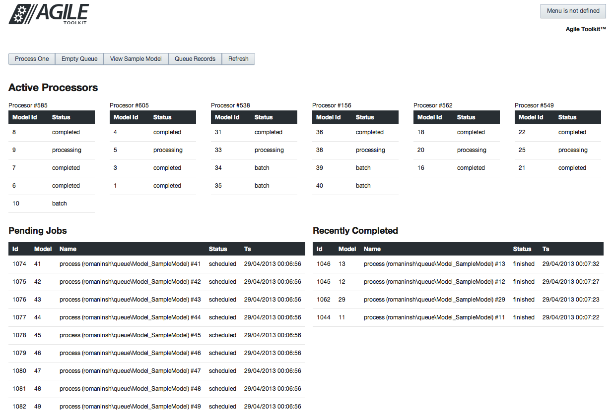

# Simple Queue Implementation for Agile Toolkit

This is an implementation of a simple queuing mechanism based on MySQL table. The goal of this implementation is to be simple and accessible to developer, for a high-performance queues [look at alternatives](http://en.wikipedia.org/wiki/Message_queue).



## Installing

You can install either from git or through composer. [https://packagist.org/packages/atk4/queue](https://packagist.org/packages/atk4/queue). Refer to add-on installation documentation for Agile Toolkit.

## Usage

 - Import doc/queue.sql.
 - Whenever you need to use queue:
 
```
$processor = $this->add('romaninsh/queue/Controller_QueueProcessor');
```

 - call `$processor->schedule($model)`. This will schedule call to method `$model->process` for each record in accessible set (respects conditions).
 - call `processor->process()` to reserve 5 (default) records from the queue and process them.
 
## Demo Video

In-detail walkthrough is available here:

[https://www.youtube.com/watch?v=gXrq8af97GM](https://www.youtube.com/watch?v=gXrq8af97GM)